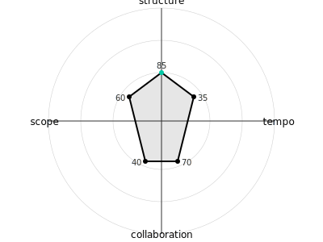
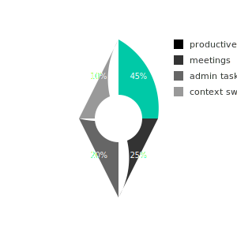
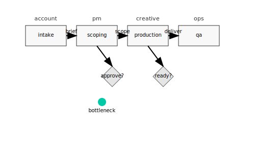
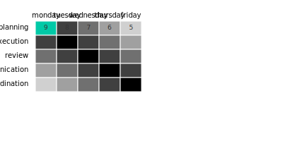
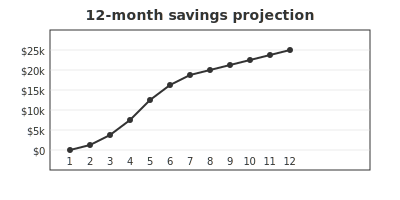
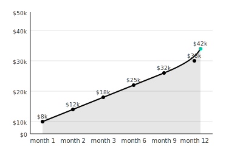
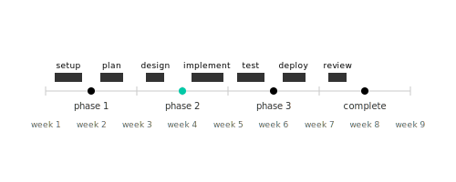

# calm.profile diagnostic report

## executive summary

**{{ company_name | default('—') }}** · **{{ assessment_date | default('—') }}** · **{{ report_id | default('—') }}**

{{ archetype_primary | default('—') }} archetype detected with {{ fmt_percent(archetype_confidence | default(0)) }} confidence.

**headline roi:**

- estimated productivity overhead: {{ fmt_percent(overhead_percentage | default(0)) }}
- projected annual cost impact: {{ fmt_currency(annual_cost | default(0)) }}
- break-even timeline: {{ break_even_timeline | default('—') }}

**top findings:**
{{ top_findings | default('—') }}

**methodology overview:**
this assessment analyzes 20 behavioral indicators across six core axes: decision-making, collaboration, cadence, planning horizon, documentation, tooling posture. responses are mapped to established archetypes and calibrated against team context variables including meeting load, team size, and hourly rates.

## scope & methodology

| component          | detail                                                         |
| ------------------ | -------------------------------------------------------------- | ------------------------------------------------------------ |
| interviews         | 12 people (account 3, pm 3, creative 4, ops 2)                 |
| projects observed  | 8 (brand, campaign, web, content)                              |
| time windows       | calendars + zoom logs: last 90 days                            |
| systems/logs       | asana, notion, monday; gdrive version logs                     |
| artifacts reviewed | 14 briefs, 11 scopes, 9 estimates                              |
| scoring rubric     | 1–5 across speed/quality/predictability/efficiency/team health |
| limits             | self-report ±10%, seasonal skew (q4)                           |
| roi assumptions    | team size {{ team_size                                         | default('—') }}, blended rates (see p8), adoption speed (p9) |

**assessment methodology:**

- behavioral indicators: 20 questions across 6 axes
- archetype matching: euclidean distance calculation
- archetype scoring via euclidean distance calculation
- overhead calculation: base rate × archetype adjustment × team multiplier
- roi projection: hours lost per week × 52 weeks × hourly rate × team size

**confidence indicators:**

- high confidence: >80% archetype match
- medium confidence: 60-80% archetype match
- low confidence: <60% archetype match

## workstyle profile

**axis interpretation:**

- **decision-making**: preference for systematic approaches, frameworks, and organized processes
- **collaboration**: comfort level with team dynamics, communication, and shared decision-making
- **cadence**: preference for steady, methodical work vs rapid iteration and change
- **planning horizon**: tendency toward big-picture thinking vs detail-oriented execution
- **documentation**: approach to knowledge capture and information sharing
- **tooling posture**: comfort with technology adoption and digital workflows

**profile insights:**
{{ radar_insights | default('—') }}

**key patterns identified:**

- sync bias → f2: meeting bloat
- interrupt-driven → f3: context switching

## workstyle profile (continued)

**workflow responsibilities:**

| workflow | responsible | accountable | support | consulted | informed |
| | -- | -- | -- | -- | -- |
| intake | {{ workflow1_r | default('—') }} | {{ workflow1_a | default('—') }} | {{ workflow1_s | default('—') }} | {{ workflow1_c | default('—') }} | {{ workflow1_i | default('—') }} |
| scoping | {{ workflow2_r | default('—') }} | {{ workflow2_a | default('—') }} | {{ workflow2_s | default('—') }} | {{ workflow2_c | default('—') }} | {{ workflow2_i | default('—') }} |
| production | {{ workflow3_r | default('—') }} | {{ workflow3_a | default('—') }} | {{ workflow3_s | default('—') }} | {{ workflow3_c | default('—') }} | {{ workflow3_i | default('—') }} |
| qa | {{ workflow4_r | default('—') }} | {{ workflow4_a | default('—') }} | {{ workflow4_s | default('—') }} | {{ workflow4_c | default('—') }} | {{ workflow4_i | default('—') }} |
| delivery/invoicing | {{ workflow5_r | default('—') }} | {{ workflow5_a | default('—') }} | {{ workflow5_s | default('—') }} | {{ workflow5_c | default('—') }} | {{ workflow5_i | default('—') }} |

## findings

### f1: {{ f1_issue | default('—') }}

**evidence:** {{ f1_evidence | default('—') }}  
**impact:** {{ f1_impact | default('—') }}  
**root cause:** {{ f1_root_cause | default('—') }}  
**preview:** {{ f1_preview | default('—') }}

### f2: {{ f2_issue | default('—') }}

**evidence:** {{ f2_evidence | default('—') }}  
**impact:** {{ f2_impact | default('—') }}  
**root cause:** {{ f2_root_cause | default('—') }}  
**preview:** {{ f2_preview | default('—') }}

**process efficiency scores:**

- planning: {{ fmt_round(efficiency_planning | default(0)) }}/10
- execution: {{ fmt_round(efficiency_execution | default(0)) }}/10
- review: {{ fmt_round(efficiency_review | default(0)) }}/10
- communication: {{ fmt_round(efficiency_communication | default(0)) }}/10

**bottleneck identification:**
{{ workflow_bottlenecks | default('—') }}

## findings (continued)

### f3: {{ f3_issue | default('—') }}

**evidence:** {{ f3_evidence | default('—') }}  
**impact:** {{ f3_impact | default('—') }}  
**root cause:** {{ f3_root_cause | default('—') }}  
**preview:** {{ f3_preview | default('—') }}

### f4: {{ f4_issue | default('—') }}

**evidence:** {{ f4_evidence | default('—') }}  
**impact:** {{ f4_impact | default('—') }}  
**root cause:** {{ f4_root_cause | default('—') }}  
**preview:** {{ f4_preview | default('—') }}

## findings (continued)

### f5: {{ f5_issue | default('—') }}

**evidence:** {{ f5_evidence | default('—') }}  
**impact:** {{ f5_impact | default('—') }}  
**root cause:** {{ f5_root_cause | default('—') }}  
**preview:** {{ f5_preview | default('—') }}

**findings ↔ recommendations mapping:**

| finding | issue       | recommendation  | solution |
| ------- | ----------- | --------------- | -------- | ----------- | --------------- |
| f1      | {{ f1_issue | default('—') }} | r1       | {{ r1_title | default('—') }} |
| f2      | {{ f2_issue | default('—') }} | r2       | {{ r2_title | default('—') }} |
| f3      | {{ f3_issue | default('—') }} | r3       | {{ r3_title | default('—') }} |
| f4      | {{ f4_issue | default('—') }} | r4       | {{ r4_title | default('—') }} |
| f5      | {{ f5_issue | default('—') }} | r5       | {{ r5_title | default('—') }} |

## roi impact

**current state costs:**

- weekly productivity loss: {{ fmt_hours(hours_lost_ppw | default(0)) }} hours
- annual cost impact: {{ fmt_currency(annual_cost | default(0)) }}
- team multiplier effect: {{ team_multiplier | default(1) }}x

**projected savings:**

- month 1: {{ fmt_percent(savings_month1 | default(0)) }} improvement
- month 3: {{ fmt_percent(savings_month3 | default(0)) }} improvement
- month 6: {{ fmt_percent(savings_month6 | default(0)) }} improvement
- month 12: {{ fmt_percent(savings_month12 | default(0)) }} improvement

**break-even timeline:**
{{ break_even_timeline | default('—') }}

**roi formulas:**

- base overhead: {{ fmt_percent(base_overhead | default(0)) }} adjusted to {{ fmt_percent(overhead_percentage | default(0)) }} given team factors (archetype: {{ fmt_round(archetype_adjustment | default(0), 1) }}, team multiplier: {{ team_multiplier | default(1) }})
- weekly cost: {{ fmt_hours(hours_lost_ppw | default(0)) }} hours × {{ fmt_currency(hourly_rate | default(0)) }} × {{ team_multiplier | default(1) }} people = {{ fmt_currency(weekly_cost | default(0)) }}
- annual cost: {{ fmt_currency(weekly_cost | default(0)) }} × 52 weeks = {{ fmt_currency(annual_cost | default(0)) }}

**blended rates:** account $95 / pm $85 / creative $125 / ops $80  
**line items:** meetings, review latency, duplicate entry, rework, estimate variance, write-offs  
*formulas:* capacity = (baseline hrs − improved hrs) × volume; blended rate = current ÷ baseline hrs; delta$ = current − improved

## roi impact (continued)

**sensitivity analysis:**

| implementation success | margin (pp) | $/q | hours released/q |
| - | | | -- |
| 25% | {{ fmt_percent(sensitivity_25_margin | default(0)) }} pp | {{ fmt_currency(sensitivity_25_cost | default(0)) }} | {{ fmt_hours(sensitivity_25_hours | default(0)) }} |
| 50% | {{ fmt_percent(sensitivity_50_margin | default(0)) }} pp | {{ fmt_currency(sensitivity_50_cost | default(0)) }} | {{ fmt_hours(sensitivity_50_hours | default(0)) }} |
| 75% | {{ fmt_percent(sensitivity_75_margin | default(0)) }} pp | {{ fmt_currency(sensitivity_75_cost | default(0)) }} | {{ fmt_hours(sensitivity_75_hours | default(0)) }} |

**adoption scenarios:**

| scenario | team adoption | timeline | 5-yr savings |
| | - | -- | |
| conservative | 25% | 6 months | {{ fmt_currency(conservative_5yr | default(0)) }} |
| realistic | 50% | 4 months | {{ fmt_currency(realistic_5yr | default(0)) }} |
| optimistic | 75% | 3 months | {{ fmt_currency(optimistic_5yr | default(0)) }} |

## recommendations

### r1: {{ r1_title | default('—') }}

**linked to:** f{{ r1_linked_finding | default('—') }}  
**description:** {{ r1_description | default('—') }}  
**impact:** {{ r1_impact | default('—') }}  
**effort:** {{ r1_effort | default('—') }}  
**rice score:** {{ fmt_int(r1_rice | default(0)) }}

### r2: {{ r2_title | default('—') }}

**linked to:** f{{ r2_linked_finding | default('—') }}  
**description:** {{ r2_description | default('—') }}  
**impact:** {{ r2_impact | default('—') }}  
**effort:** {{ r2_effort | default('—') }}  
**rice score:** {{ fmt_int(r2_rice | default(0)) }}

### r3: {{ r3_title | default('—') }}

**linked to:** f{{ r3_linked_finding | default('—') }}  
**description:** {{ r3_description | default('—') }}  
**impact:** {{ r3_impact | default('—') }}  
**effort:** {{ r3_effort | default('—') }}  
**rice score:** {{ fmt_int(r3_rice | default(0)) }}

## recommendations (continued)

### r4: {{ r4_title | default('—') }}

**linked to:** f{{ r4_linked_finding | default('—') }}  
**description:** {{ r4_description | default('—') }}  
**impact:** {{ r4_impact | default('—') }}  
**effort:** {{ r4_effort | default('—') }}  
**rice score:** {{ fmt_int(r4_rice | default(0)) }}

### r5: {{ r5_title | default('—') }}

**linked to:** f{{ r5_linked_finding | default('—') }}  
**description:** {{ r5_description | default('—') }}  
**impact:** {{ r5_impact | default('—') }}  
**effort:** {{ r5_effort | default('—') }}  
**rice score:** {{ fmt_int(r5_rice | default(0)) }}

**critical path:**
{{ critical_path | default('—') }}

**milestone schedule:**
{{ milestone_schedule | default('—') }}

## 30/60/90 roadmap

**30-day quick wins:**
{{ roadmap_30_days | default('—') }}

**60-day foundations:**
{{ roadmap_60_days | default('—') }}

**90-day optimization:**
{{ roadmap_90_days | default('—') }}

**success kpis:**

| metric | baseline | target | owner |
| -- | -- | | -- |
| on-time delivery | {{ fmt_percent(baseline_ontime | default(0)) }} | {{ fmt_percent(target_ontime | default(0)) }} | {{ owner_ontime | default('—') }} |
| latency reduction | {{ fmt_percent(baseline_latency | default(0)) }} | {{ fmt_percent(target_latency | default(0)) }} | {{ owner_latency | default('—') }} |
| estimate variance | {{ fmt_percent(baseline_variance | default(0)) }} pp | {{ fmt_percent(target_variance | default(0)) }} pp | {{ owner_variance | default('—') }} |
| change-order capture | {{ fmt_percent(baseline_change | default(0)) }} | {{ fmt_percent(target_change | default(0)) }} | {{ owner_change | default('—') }} |

**next steps:**
{{ next_steps | default('—') }}

_appendix (tool audit, survey cuts, rasic drafts, raw tables) is provided off-doc via qr/link to a shared folder._
